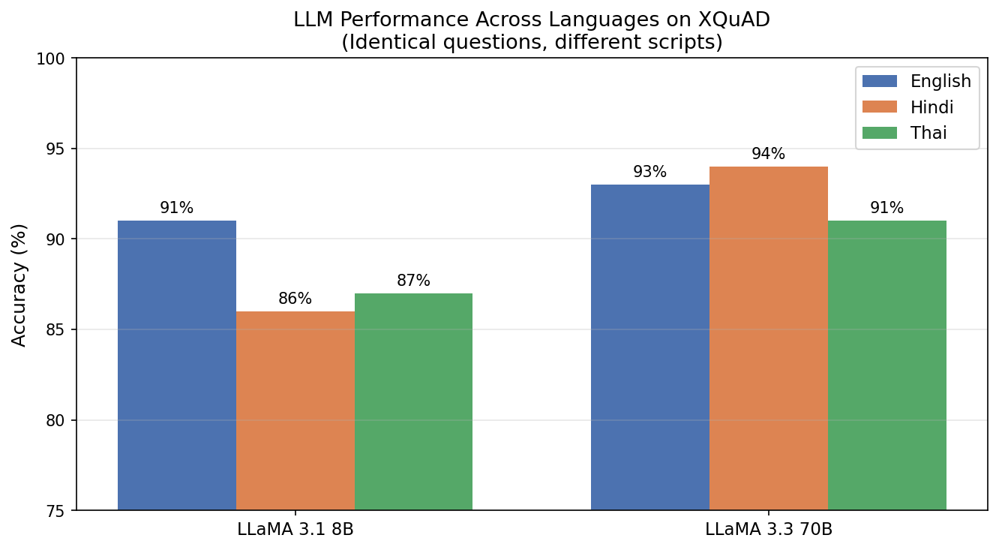

# Indic LLM Evaluation: Hindi vs English vs Thai on XQuAD

## Research Question
Do LLMs perform worse on non-Latin scripts compared to English?
Does scaling the model reduce this performance gap?

## Dataset
- **XQuAD** by Google — 100 identical questions in English, Hindi, Thai
- Same contexts, same answers — only language/script differs

## Models
- LLaMA 3.1 8B (small model)
- LLaMA 3.3 70B (large model)

## Results

| Model | English | Hindi | Thai |
|---|---|---|---|
| LLaMA 3.1 8B | 91% | 86% | 87% |
| LLaMA 3.3 70B | 93% | 94% | 91%* |

*70B Thai: n=80 due to API rate limit

## Key Findings
1. **Small models underperform on non-Latin scripts** — 8B shows 4-5% gap vs English
2. **Scaling reverses the gap** — 70B model scores higher on Hindi (94%) than English (93%)
3. **Hindi benefits more from scaling than Thai** — suggesting more Indic data in LLaMA 3.3 training

## Error Analysis (LLaMA 8B, Hindi failures)
| Error Type | Count |
|---|---|
| Number confusion (Hindi word vs digit) | 2 |
| Wrong entity selection | 1 |
| Negation misunderstood | 1 |
| Off-by-one numeric error | 1 |

## Chart

## Connection to Prior Work
Findings support LLINK (Gupta & Agarwal, 2025) — cross-lingual alignment 
improves with scale, suggesting encoder injection may be less necessary 
for larger models but critical for smaller/efficient ones.

## Files
- `xquad_results.csv` — all predictions
- `summary.json` — summary stats
- `results_chart.png` — results visualization

## Next Steps
- Few-shot prompting experiments
- Extend to Arabic and Chinese (also in XQuAD)
- Compare encoder-injected models vs vanilla LLMs
