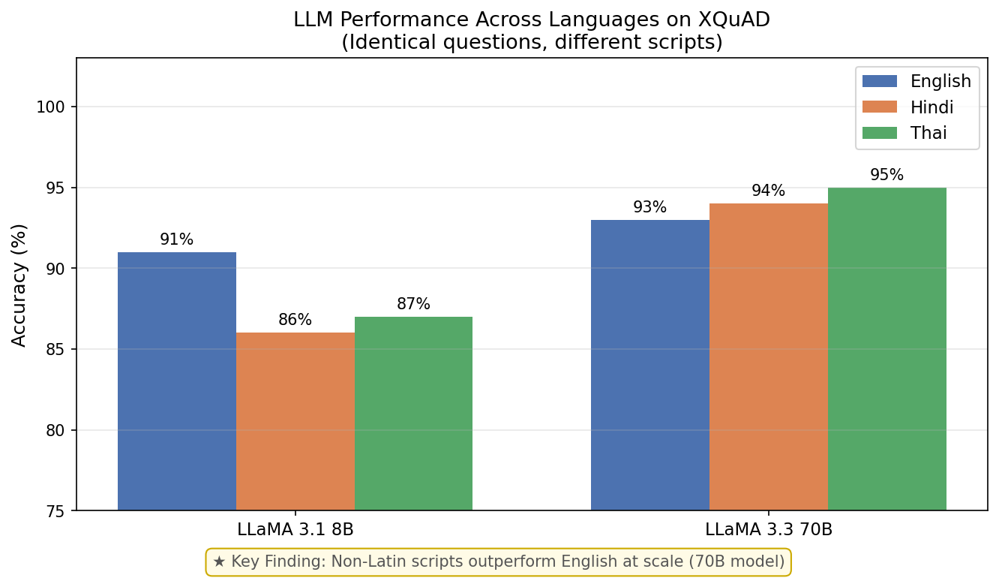

# Does Scale Close the Script Gap?
## Evaluating LLMs on Non-Latin Languages Using XQuAD

**Sahil Bhardwaj** | Somaiya VidyaVihar University, India  
📄 [Read the Paper](Paper.pdf) | [Raw Results](xquad_results.csv)

---

## Overview
Do LLMs perform worse on non-Latin scripts like Hindi and Thai compared to English?
Does scaling the model close this gap?

We evaluated LLaMA 3.1 8B and LLaMA 3.3 70B on identical questions across English, Hindi, and Thai using the XQuAD benchmark.

---

## Key Results

| Model | English | Hindi | Thai |
|---|---|---|---|
| LLaMA 3.1 8B | 91% | 86% | 87% |
| LLaMA 3.3 70B | 93% | 94% | 95% |

---

## Key Finding
Scaling reverses the Hindi-English performance gap.
- Small models (8B) show a consistent 4-5% English-bias on non-Latin scripts
- Large models (70B) eliminate and reverse this gap — Hindi (94%) and Thai (95%) outperform English (93%)
- Cross-lingual transfer improves superlinearly with scale

---

## Error Analysis (LLaMA 8B, Hindi failures)

| Error Type | Cases |
|---|---|
| Number confusion (Hindi word vs digit) | 2 |
| Wrong entity selection | 1 |
| Negation misunderstood | 1 |
| Off-by-one numeric error | 1 |

---

## Methodology
- **Dataset:** XQuAD — 100 identical questions in English, Hindi, Thai
- **Models:** LLaMA 3.1 8B and LLaMA 3.3 70B via Groq API
- **Evaluation:** Zero-shot prompting, substring match accuracy

---

## Repository Structure
- `evaluation.ipynb` — full experiment notebook
- `xquad_results.csv` — all 400 predictions
- `summary.json` — summary statistics
- `results_chart_final.png` — results visualization
- `paper.pdf` — full paper

---

## Connection to Prior Work
Findings complement LLINK (Gupta & Agarwal, 2025) — cross-lingual encoder injection achieves large-model performance at small-model cost. Our results suggest such approaches are especially critical for sub-70B deployments.

---

## Next Steps
- Few-shot prompting experiments
- Extend to Arabic and Chinese (also in XQuAD)
- Compare encoder-injected models vs vanilla LLMs
