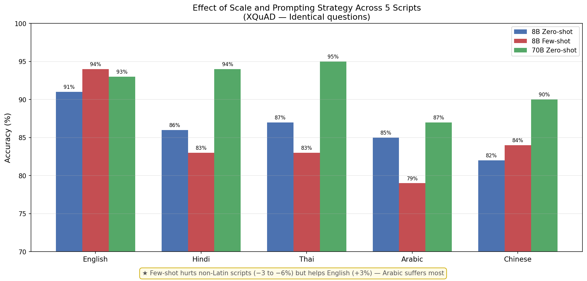

# Scale Helps, Few-Shot Hurts: Evaluating LLMs Across Five Non-Latin Scripts

**Sahil Bhardwaj** | Somaiya VidyaVihar University, Mumbai, India  
[Read the Paper](Paper.pdf) | [Raw Results](all_results.json) | [Notebook](evaluation.ipynb)

---

## Overview

We systematically evaluate LLaMA 3.1 8B and LLaMA 3.3 70B across five languages on the XQuAD benchmark under zero-shot and few-shot conditions. Using identical questions across all languages, we isolate the effect of script, scale, and prompting strategy on model performance.

**Languages:** English · Hindi (Devanagari) · Thai (Tai) · Arabic (Semitic) · Chinese (Logographic)

---

## Key Results

| Setting | English | Hindi | Thai | Arabic | Chinese |
|---|---|---|---|---|---|
| LLaMA 3.1 8B — Zero-shot | 91% | 86% | 87% | 85% | 82% |
| LLaMA 3.1 8B — Few-shot | 94% | 83% | 83% | 79% | 84% |
| LLaMA 3.3 70B — Zero-shot | 93% | 94% | 95% | 87% | 90% |
| Δ Scale | +2% | +8% | +8% | +2% | +8% |
| Δ Few-shot | +3% | −3% | −4% | −6% | +2% |



---

## Three Key Findings

**Finding 1 — Scale closes the English-bias for most scripts**
LLaMA 3.1 8B shows a 4–9% English-bias across non-Latin scripts. Scaling to 70B eliminates this for Hindi, Thai, and Chinese (+8% each), with these languages actually surpassing English.

**Finding 2 — Arabic uniquely resists scale**
Despite moderate tokenizer inflation (+231%), Arabic gains only +2% from scaling — identical to English's own gain. Hindi and Thai have far higher token inflation (+309%, +323%) yet benefit 4x more from scaling, suggesting Arabic's resistance is morphological, not tokenization-driven.

**Finding 3 — Few-shot prompting hurts non-Latin scripts**
Few-shot prompting improves English (+3%) but degrades all non-Latin scripts except Chinese. Arabic suffers most (−6%), dropping to 79% — below its zero-shot baseline. In-language demonstrations confuse rather than guide smaller models on morphologically complex scripts.

---

## Tokenization Analysis

| Language | Avg Tokens | Inflation vs English |
|---|---|---|
| English | 181 | — |
| Chinese | 376 | +107% |
| Arabic | 600 | +231% |
| Hindi | 743 | +309% |
| Thai | 768 | +323% |

Token inflation alone does not explain performance gaps — Arabic has moderate inflation but the worst scale benefit, pointing to morphological complexity as the key factor.

---

## Error Analysis (LLaMA 8B, Hindi failures)

| Error Type | Cases |
|---|---|
| Number confusion (Hindi word vs digit) | 2 |
| Wrong entity selection | 1 |
| Negation misunderstood | 1 |
| Off-by-one numeric error | 1 |

---

## Methodology

- **Dataset:** XQuAD - 100 identical questions in 5 languages
- **Models:** LLaMA 3.1 8B and LLaMA 3.3 70B via Groq API
- **Prompting:** Zero-shot and 2-shot (in-language demonstrations)
- **Evaluation:** Substring match accuracy, case-insensitive

---

## Repository Structure

| File | Description |
|---|---|
| `evaluation.ipynb` | Full experiment notebook |
| `all_results.json` | Complete results across all conditions |
| `xquad_results.csv` | Raw predictions for all 100 examples |
| `results_chart_final_v3.png` | Main results figure |
| `analysis_chart.png` | Tokenization + scale benefit analysis |
| `paper.pdf` | Full paper |

---

## Connection to Prior Work

Findings complement LLINK (Gupta & Agarwal, 2025) — cross-lingual encoder injection achieves large-model performance at small-model cost. Our results show scale alone is insufficient for equitable multilingual performance, particularly for Arabic and few-shot settings, motivating continued work on architectural interventions.

---

## Citation

```bibtex
@article{bhardwaj2026scale,
  title={Scale Helps, Few-Shot Hurts: Evaluating LLMs Across Five Non-Latin Scripts},
  author={Bhardwaj, Sahil},
  journal={arXiv preprint},
  year={2026}
}
```

---

*MS IT Student, Somaiya VidyaVihar University | Research interests: Multilingual NLP, Cross-lingual Transfer, LLM Evaluation*
